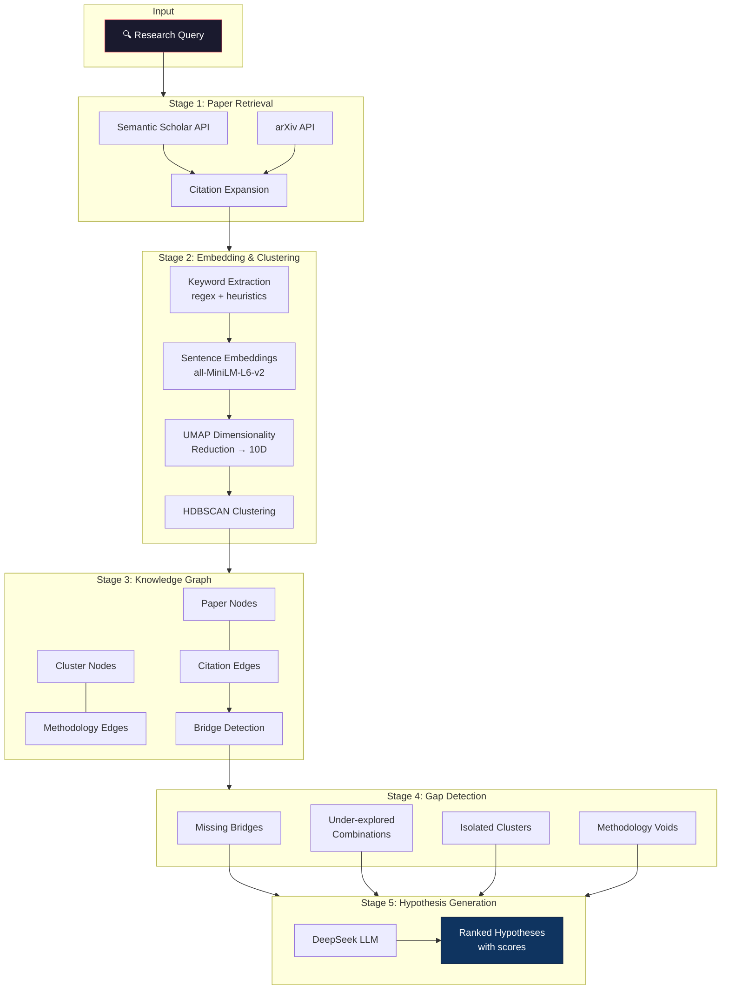
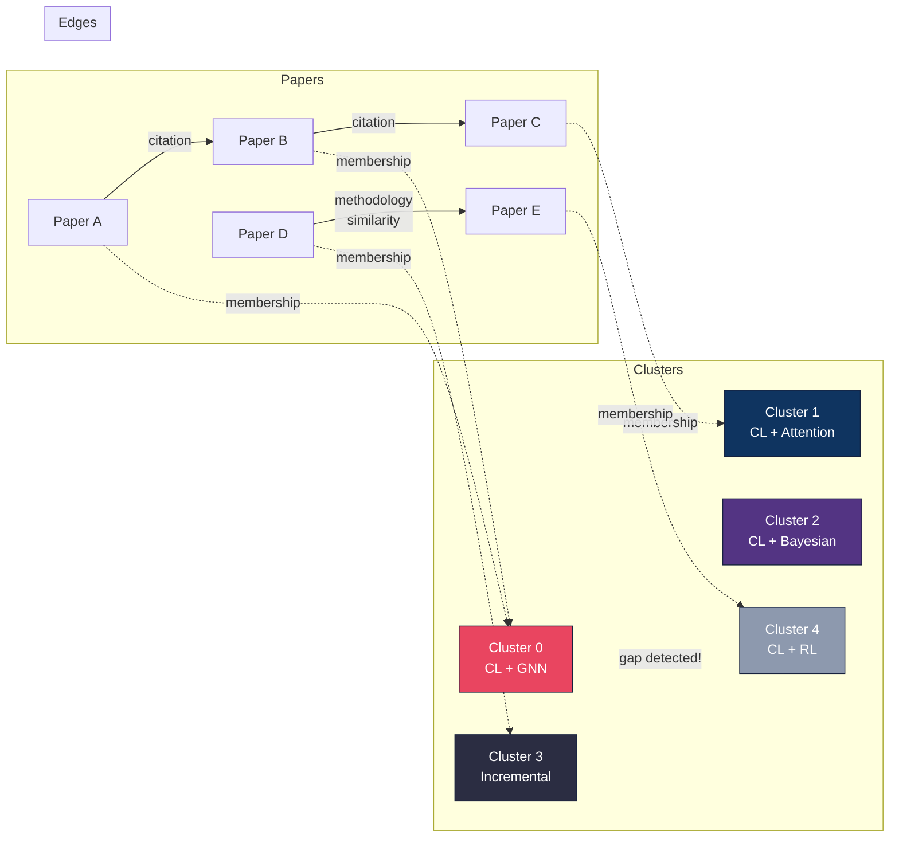
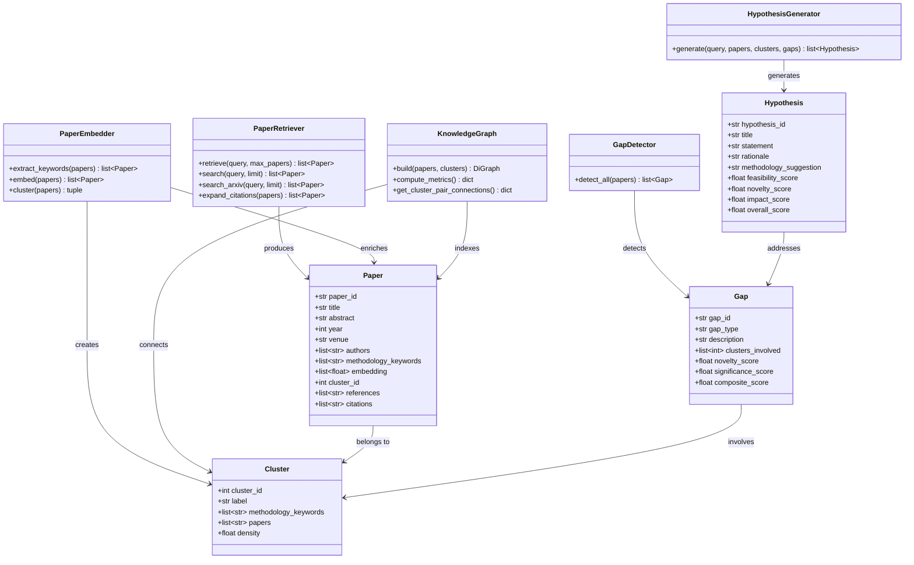
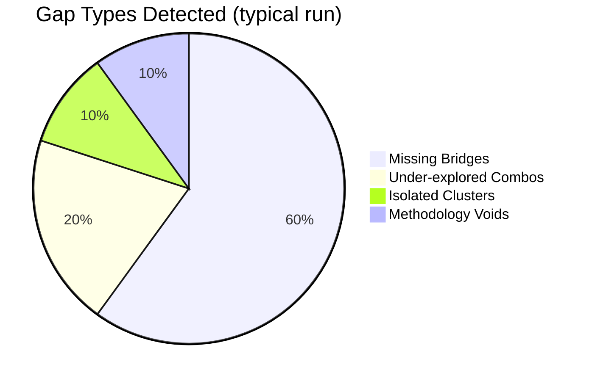

<div align="center">

# 🔬 PaperSynth Agent

### Literature-to-Hypothesis Pipeline for Academic Research

[](https://www.python.org/downloads/)
[](LICENSE)
[](https://www.semanticscholar.org/product/api)
[](https://info.arxiv.org/help/api/index.html)
[](https://platform.deepseek.com)

**PaperSynth** is an autonomous research agent that searches academic literature, clusters papers by methodology, detects research gaps, and generates novel hypotheses — all from a single query.

</div>

---

## 🎯 What Does It Do?

Given a research topic, PaperSynth:

1. **Fetches** papers from [Semantic Scholar](https://www.semanticscholar.org/) and [arXiv](https://arxiv.org/)
2. **Embeds** papers using sentence-transformers and **clusters** them by methodology
3. **Builds** a citation-methodology knowledge graph
4. **Detects** research gaps across 4 strategies
5. **Generates** ranked, testable hypotheses via DeepSeek LLM

---

## 🏗️ Pipeline Architecture



---

## 📊 Knowledge Graph Structure



---

## 🚀 Quick Start

### Prerequisites

- Python 3.10+
- [DeepSeek API key](https://platform.deepseek.com/) (for hypothesis generation)
- [Semantic Scholar API key](https://www.semanticscholar.org/product/api#api-key-form) (optional, for higher rate limits)

### Installation

```bash
# Clone the repository
git clone https://github.com/raktim-mondol/papersynth.git
cd papersynth

# Create virtual environment
python3 -m venv .venv
source .venv/bin/activate

# Install dependencies
pip install -e .

# Configure API keys
cp .env.example .env
# Edit .env with your keys:
#   DEEPSEEK_API_KEY=sk-...
#   S2_API_KEY=s2k-...  (optional)
```

### Basic Usage

```bash
# Full pipeline (search → cluster → gaps → hypotheses)
papersynth "continual learning for neural networks"

# Customize limits
papersynth "CRISPR delivery mechanisms" --max-papers 100 --top-hypotheses 5

# Fast mode (skip LLM hypothesis generation)
papersynth "single cell RNA sequencing" --no-hypotheses

# Verbose debug output
papersynth "federated learning privacy" -v
```

---

## 📖 Detailed Usage

### Command-Line Options

```
papersynth <QUERY> [OPTIONS]

Arguments:
  QUERY                    Research topic or question

Options:
  -n, --max-papers N       Maximum papers to fetch (default: 200)
  -h, --top-hypotheses N   Number of hypotheses to generate (default: 5)
  --no-hypotheses          Skip hypothesis generation (faster)
  -o, --output-dir PATH    Custom output directory
  -v, --verbose            Enable debug logging
  --help                   Show help message
```

### Example Session

```bash
$ papersynth "continual learning catastrophic forgetting" --max-papers 80

╭────────────────────────────── PaperSynth Agent ──────────────────────────────╮
│ continual learning catastrophic forgetting                                    │
╰───────────────── Literature → Clusters → Gaps → Hypotheses ──────────────────╯
✓ Fetched 80 papers
✓ Extracted methodology keywords
✓ Generated embeddings
✓ Found 7 methodology clusters
✓ Built graph: 87 nodes, 346 edges
✓ Detected 10 research gaps
✓ Generated 3 hypotheses

Pipeline completed in 87.2s
```

---

## 🔧 Configuration

All settings are in `papersynth/config.py` and can be overridden via environment variables or `.env`:

| Setting | Default | Description |
|---------|---------|-------------|
| `DEEPSEEK_API_KEY` | — | DeepSeek API key for hypothesis generation |
| `S2_API_KEY` | — | Semantic Scholar API key (higher rate limits) |
| `DEEPSEEK_MODEL` | `deepseek-chat` | DeepSeek model name |
| `EMBEDDING_MODEL` | `all-MiniLM-L6-v2` | Sentence-transformers model |
| `MAX_PAPERS` | `200` | Maximum papers to fetch |
| `CLUSTER_MIN_SIZE` | `3` | Minimum papers per cluster |
| `TOP_GAPS` | `10` | Number of gaps to report |
| `TOP_HYPOTHESES` | `5` | Number of hypotheses to generate |
| `UMAP_N_COMPONENTS` | `10` | UMAP target dimensions |
| `S2_RATE_LIMIT_DELAY` | `1.0` | Seconds between S2 API calls |

---

## 📁 Project Structure

```
papersynth/
├── README.md                 # This file
├── LICENSE                   # MIT License
├── pyproject.toml            # Package configuration
├── .env.example              # API key template
├── .gitignore
├── docs/
│   ├── architecture.md       # Detailed system architecture
│   └── modules.md            # Module API reference
├── papersynth/
│   ├── __init__.py           # Package metadata
│   ├── cli.py                # CLI entry point + orchestrator
│   ├── config.py             # Configuration management
│   ├── models.py             # Data models (Paper, Cluster, Gap, Hypothesis)
│   ├── retriever.py          # Paper retrieval (Semantic Scholar + arXiv)
│   ├── embedder.py           # Embedding + clustering (sentence-transformers + HDBSCAN)
│   ├── graph.py              # Knowledge graph builder (NetworkX)
│   ├── gap_detector.py       # Research gap detection engine
│   └── hypothesizer.py       # LLM hypothesis generation (DeepSeek)
├── output/                   # Generated results (JSON)
└── tests/
    └── test_pipeline.py      # Test suite
```

---

## 🧩 Module Overview



---

## 🔍 Gap Detection Strategies

PaperSynth uses **4 complementary strategies** to find research gaps:

### 1. Missing Bridges
Clusters that share methodology keywords but have few/no cross-citations. These represent natural connections that haven't been made yet.

### 2. Under-explored Combinations
Methodology keyword pairs that appear individually in the corpus but are never combined in a single paper — potential for methodological fusion.

### 3. Isolated Clusters
Research threads that are internally cohesive (high density) but have few external connections — opportunities for cross-pollination.

### 4. Methodology Voids
Common methodologies in the research field that are absent from the retrieved corpus — unexplored methodological directions.



---

## 📊 Output Format

Results are saved as JSON to `output/`:

```json
{
  "query": "continual learning for neural networks",
  "papers": [
    {
      "paper_id": "abc123",
      "title": "...",
      "abstract": "...",
      "year": 2024,
      "methodology_keywords": ["continual", "catastrophic forgetting"],
      "cluster_id": 0
    }
  ],
  "clusters": [
    {
      "cluster_id": 0,
      "label": "continual + catastrophic forgetting + graph neural",
      "methodology_keywords": ["continual", "catastrophic forgetting", "graph neural"],
      "paper_count": 16,
      "density": 0.45
    }
  ],
  "gaps": [
    {
      "gap_type": "missing_bridge",
      "description": "Clusters share keywords but have no cross-citations...",
      "novelty_score": 0.82,
      "composite_score": 0.75
    }
  ],
  "hypotheses": [
    {
      "title": "Graph Regularization for RL in Continual Learning",
      "statement": "Integrating GNN-based regularization into RL continual learning...",
      "feasibility_score": 0.70,
      "novelty_score": 0.80,
      "impact_score": 0.90,
      "overall_score": 0.79
    }
  ]
}
```

---

## 🛠️ Dependencies

| Package | Purpose |
|---------|---------|
| `sentence-transformers` | Paper embedding (all-MiniLM-L6-v2) |
| `hdbscan` | Density-based clustering |
| `umap-learn` | Dimensionality reduction |
| `networkx` | Knowledge graph construction |
| `httpx` | Async HTTP client (S2 + arXiv APIs) |
| `openai` | DeepSeek API client |
| `rich` | Beautiful terminal output |
| `click` | CLI framework |
| `scikit-learn` | ML utilities |
| `python-dotenv` | Environment configuration |

---

## 🧪 Running Tests

```bash
source .venv/bin/activate
pip install -e ".[dev]"
pytest tests/ -v
```

---

## 📚 Documentation

- **[Architecture Guide](docs/architecture.md)** — Detailed system design, data flow, and design decisions
- **[Module Reference](docs/modules.md)** — API documentation for every module

---

## 🤝 Contributing

See [CONTRIBUTING.md](CONTRIBUTING.md) for guidelines.

```bash
# Development setup
git clone https://github.com/raktim-mondol/papersynth.git
cd papersynth
python3 -m venv .venv
source .venv/bin/activate
pip install -e ".[dev]"
```

---

## 📄 License

This project is licensed under the MIT License — see [LICENSE](LICENSE) for details.

---

## 🙏 Acknowledgments

- [Semantic Scholar](https://www.semanticscholar.org/) for the academic graph API
- [arXiv](https://arxiv.org/) for open access to research papers
- [sentence-transformers](https://www.sbert.net/) for paper embeddings
- [DeepSeek](https://platform.deepseek.com/) for LLM-powered hypothesis generation
- [HDBSCAN](https://hdbscan.readthedocs.io/) for robust density-based clustering

---

<div align="center">

**Built with 🔬 by [Raktim Mondol](https://github.com/raktim-mondol)**

*PaperSynth — From Literature to Discovery*
</div>
