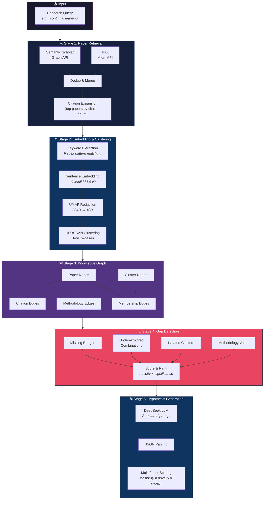
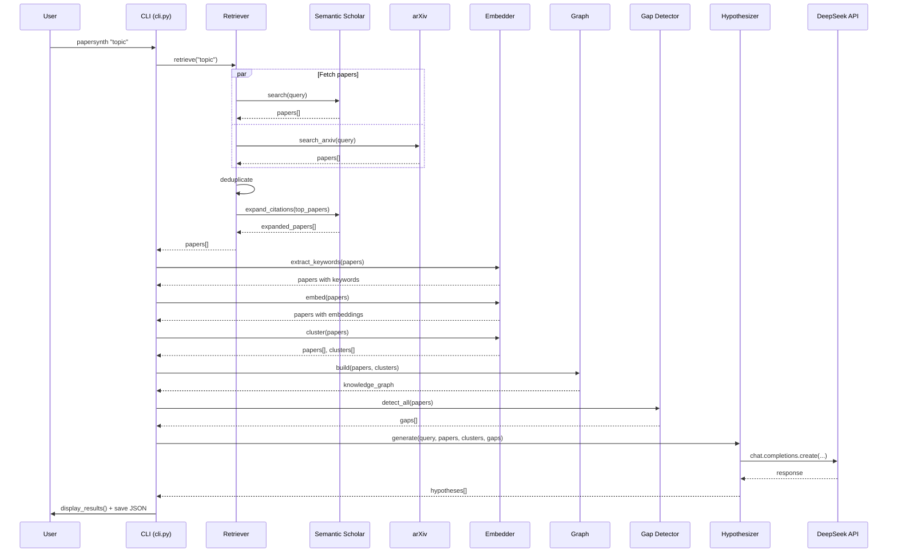

# PaperSynth Architecture Guide

## Overview

PaperSynth is a 5-stage autonomous research pipeline that transforms a natural language query into ranked research hypotheses. Each stage is modular and can be used independently.

## System Architecture



## Data Flow



## Module Dependencies

```mermaid
graph TD
    cli["cli.py<br/><i>Orchestrator</i>"]
    config["config.py<br/><i>Settings</i>"]
    models["models.py<br/><i>Data structures</i>"]
    retriever["retriever.py<br/><i>Paper fetching</i>"]
    embedder["embedder.py<br/><i>Embedding + Clustering</i>"]
    graph["graph.py<br/><i>Knowledge graph</i>"]
    gap_detector["gap_detector.py<br/><i>Gap analysis</i>"]
    hypothesizer["hypothesizer.py<br/><i>LLM generation</i>"]

    cli --> retriever
    cli --> embedder
    cli --> graph
    cli --> gap_detector
    cli --> hypothesizer
    cli --> config
    cli --> models

    retriever --> config
    retriever --> models
    
    embedder --> config
    embedder --> models
    
    graph --> models
    
    gap_detector --> models
    gap_detector --> graph
    gap_detector --> config
    
    hypothesizer --> config
    hypothesizer --> models

    style cli fill:#e94560,stroke:#1a1a2e,color:#fff
    style config fill:#533483,stroke:#16213e,color:#fff
    style models fill:#0f3460,stroke:#16213e,color:#fff
```

## Design Decisions

### Why Sentence-Transformers over LLM Embeddings?
- **Speed**: `all-MiniLM-L6-v2` embeds 50 papers in <1 second
- **Cost**: Zero API calls for embedding
- **Quality**: 384-dim embeddings capture semantic similarity well enough for clustering
- **Offline**: Works without internet after model download

### Why HDBSCAN over K-Means?
- **No predefined K**: We don't know how many methodology clusters exist
- **Noise handling**: Papers that don't fit any cluster are labeled as noise (-1)
- **Density-based**: Naturally finds clusters of varying sizes and shapes
- **Robust**: Works well with UMAP-reduced embeddings

### Why UMAP before Clustering?
- Reduces 384D embeddings to 10D, removing noise while preserving structure
- Makes HDBSCAN's Euclidean metric meaningful for high-dimensional data
- Speeds up clustering significantly

### Why NetworkX for the Graph?
- Pure Python — no compiled dependencies
- Rich algorithm library (centrality, community detection, shortest paths)
- Easy serialization and visualization
- Sufficient for academic corpus sizes (100–1000 papers)

### Why DeepSeek for Hypothesis Generation?
- Excellent reasoning at low cost (~$0.01 per hypothesis generation)
- OpenAI-compatible API (easy integration via `openai` SDK)
- Good at structured JSON output
- Strong academic/technical vocabulary

## Performance Characteristics

| Stage | Time (50 papers) | Time (200 papers) | Bottleneck |
|-------|------------------|-------------------|------------|
| S2 Search | 2–5s | 5–15s | API rate limits |
| arXiv Search | 2–5s | 5–15s | XML parsing |
| Citation Expansion | 10–30s | 30–120s | S2 rate limits |
| Keyword Extraction | <1s | <2s | CPU |
| Embedding | 1–3s | 5–10s | Model inference |
| UMAP + HDBSCAN | 5–15s | 15–30s | UMAP fitting |
| Graph Building | <1s | 1–3s | CPU |
| Gap Detection | 1–3s | 3–10s | CPU |
| Hypothesis Gen | 8–15s | 8–15s | LLM latency |
| **Total** | **30–90s** | **60–240s** | S2 rate limits |

## Extending PaperSynth

### Adding a New Data Source
1. Add a new search method to `retriever.py` (e.g., `search_pubmed()`)
2. Call it in `retrieve()` alongside S2 and arXiv
3. Papers are automatically deduplicated by `paper_id`

### Adding a New Gap Detection Strategy
1. Add a new method to `GapDetector` in `gap_detector.py`
2. Return a list of `Gap` objects with the new `gap_type`
3. Call it in `detect_all()`
4. The scoring and ranking handles new types automatically

### Using a Different LLM
1. Change `DEEPSEEK_BASE_URL` and `DEEPSEEK_MODEL` in config
2. Any OpenAI-compatible API works (OpenAI, Anthropic via proxy, local vLLM)
3. The prompt templates in `hypothesizer.py` are provider-agnostic
