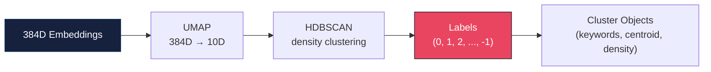

# PaperSynth Module Reference

## Table of Contents
- [models.py](#modelspy) — Data structures
- [config.py](#configpy) — Configuration
- [retriever.py](#retrieverpy) — Paper retrieval
- [embedder.py](#embedderpy) — Embedding & clustering
- [graph.py](#graphpy) — Knowledge graph
- [gap_detector.py](#gap_detectorpy) — Gap detection
- [hypothesizer.py](#hypothesizerpy) — Hypothesis generation
- [cli.py](#clipy) — CLI entry point

---

## models.py

Core data structures used throughout the pipeline.

### `Paper`
```python
@dataclass
class Paper:
    paper_id: str                           # Semantic Scholar ID or "arxiv:XXXX.XXXXX"
    title: str
    abstract: str
    year: Optional[int]
    venue: Optional[str]
    authors: list[str]
    fields_of_study: list[str]
    citation_count: int
    url: Optional[str]
    methodology_keywords: list[str]         # Populated by embedder
    embedding: Optional[list[float]]        # Populated by embedder
    cluster_id: Optional[int]               # Populated by embedder
    references: list[str]                   # paper_ids this paper cites
    citations: list[str]                    # paper_ids that cite this paper
```

### `Cluster`
```python
@dataclass
class Cluster:
    cluster_id: int
    label: str                              # Auto-generated from top keywords
    methodology_keywords: list[str]         # Top 10 keywords by frequency
    papers: list[str]                       # paper_ids in this cluster
    centroid: Optional[list[float]]         # Mean embedding vector
    description: str
    internal_citations: int                 # Citations within cluster
    external_citations: int                 # Citations to/from other clusters
    density: float                          # internal / (internal + external)
```

### `Gap`
```python
@dataclass
class Gap:
    gap_id: str
    gap_type: str                           # "missing_bridge" | "under_explored_combo" |
                                            # "isolated_cluster" | "methodology_void"
    description: str                        # Human-readable gap description
    clusters_involved: list[int]
    papers_involved: list[str]
    evidence: str                           # Supporting data
    novelty_score: float                    # 0-1
    significance_score: float               # 0-1
    composite_score: float                  # 0-1 (weighted combination)
```

### `Hypothesis`
```python
@dataclass
class Hypothesis:
    hypothesis_id: str
    title: str
    statement: str                          # The formal hypothesis
    rationale: str                          # Why it's worth investigating
    methodology_suggestion: str             # How to test it
    evidence_from_gaps: list[str]           # Gap descriptions that motivated this
    feasibility_score: float                # 0-1
    novelty_score: float                    # 0-1
    impact_score: float                     # 0-1
    overall_score: float                    # Weighted composite
    related_papers: list[str]
    related_clusters: list[int]
```

### `PipelineResult`
```python
@dataclass
class PipelineResult:
    query: str
    papers: list[Paper]
    clusters: list[Cluster]
    gaps: list[Gap]
    hypotheses: list[Hypothesis]
    papers_found: int
    clusters_found: int
    gaps_found: int
    hypotheses_generated: int
```

---

## config.py

Central configuration management. All settings can be overridden via environment variables or `.env` file.

### API Keys
| Key | Required | Description |
|-----|----------|-------------|
| `DEEPSEEK_API_KEY` | Yes (for hypotheses) | DeepSeek API key |
| `S2_API_KEY` | No | Semantic Scholar key for higher rate limits |

### Pipeline Parameters
| Parameter | Type | Default | Description |
|-----------|------|---------|-------------|
| `MAX_PAPERS` | int | 200 | Max papers to fetch |
| `CLUSTER_MIN_SIZE` | int | 3 | Min papers per HDBSCAN cluster |
| `CLUSTER_MIN_SAMPLES` | int | 2 | HDBSCAN min_samples parameter |
| `TOP_GAPS` | int | 10 | Gaps to report |
| `TOP_HYPOTHESES` | int | 5 | Hypotheses to generate |

### Model Settings
| Parameter | Type | Default | Description |
|-----------|------|---------|-------------|
| `EMBEDDING_MODEL` | str | `all-MiniLM-L6-v2` | Sentence-transformers model |
| `DEEPSEEK_MODEL` | str | `deepseek-chat` | DeepSeek model name |
| `DEEPSEEK_BASE_URL` | str | `https://api.deepseek.com` | DeepSeek API endpoint |
| `UMAP_N_COMPONENTS` | int | 10 | UMAP target dimensions |
| `UMAP_N_NEIGHBORS` | int | 15 | UMAP neighbors parameter |

---

## retriever.py

Fetches papers from Semantic Scholar and arXiv.

### `PaperRetriever`

```python
class PaperRetriever:
    async def retrieve(self, query: str, max_papers: int = None) -> list[Paper]
    """Full retrieval pipeline: search S2 + arXiv, expand citations."""
    
    async def search(self, query: str, limit: int = 100) -> list[Paper]
    """Search Semantic Scholar by keyword."""
    
    async def search_arxiv(self, query: str, limit: int = 50) -> list[Paper]
    """Search arXiv API."""
    
    async def expand_citations(self, papers: list[Paper], max_per_paper: int = 3) -> list[Paper]
    """Fetch references of top-cited papers to expand corpus."""
    
    async def close(self)
    """Close HTTP clients."""
```

**Rate limiting**: Automatically respects S2 API limits with exponential backoff. Without a key: ~1 req/3s. With key: ~10 req/s.

**Deduplication**: Papers are deduplicated by `paper_id` across all sources.

---

## embedder.py

Extracts methodology keywords, generates embeddings, and clusters papers.

### Keyword Extraction

Uses regex pattern matching against a curated list of methodology terms across CS, biology, medicine, and mathematics. Extracts terms like:
- ML: transformer, attention, CNN, GAN, reinforcement learning, fine-tuning, few-shot
- Bio: CRISPR, RNA-seq, single-cell, transcriptomics
- General: Bayesian, optimization, regularization, ablation

### `PaperEmbedder`

```python
class PaperEmbedder:
    def __init__(self, model_name: str = None)
    """Load sentence-transformers model."""
    
    def extract_keywords(self, papers: list[Paper]) -> list[Paper]
    """Extract methodology keywords from abstracts."""
    
    def embed(self, papers: list[Paper]) -> list[Paper]
    """Generate 384-dim normalized embeddings."""
    
    def cluster(self, papers: list[Paper]) -> tuple[list[Paper], list[Cluster]]
    """UMAP reduction + HDBSCAN clustering."""
```

### Clustering Pipeline



---

## graph.py

Builds and analyzes the citation-methodology knowledge graph.

### `KnowledgeGraph`

```python
class KnowledgeGraph:
    def build(self, papers: list[Paper], clusters: list[Cluster]) -> nx.DiGraph
    """Build graph with paper nodes, cluster nodes, and typed edges."""
    
    def compute_metrics(self) -> dict
    """Compute graph-level metrics for gap analysis."""
    
    def get_cluster_pair_connections(self) -> dict[tuple[int, int], int]
    """Count citation connections between each pair of clusters."""
    
    def get_cluster_keyword_profile(self) -> dict[int, dict[str, float]]
    """Normalized keyword frequency per cluster."""
```

### Graph Schema

| Node Type | Attributes |
|-----------|------------|
| `paper` | title, year, cluster_id, citation_count, keywords |
| `cluster` | label, size, density |

| Edge Type | Source → Target | Attributes |
|-----------|----------------|------------|
| `citation` | paper → paper | — |
| `methodology_sim` | paper → paper | shared_keywords, weight |
| `membership` | paper → cluster | — |

---

## gap_detector.py

Detects research gaps using 4 strategies.

### `GapDetector`

```python
class GapDetector:
    def __init__(self, graph: KnowledgeGraph)
    
    def detect_all(self, papers: list[Paper]) -> list[Gap]
    """Run all strategies, score, and return top gaps."""
```

### Strategy Details

| Strategy | Method | Score Formula |
|----------|--------|---------------|
| Missing Bridges | Compare keyword overlap vs citation count between cluster pairs | `overlap_strength × (expected / actual)` |
| Under-explored Combos | Find keyword pairs that never co-occur but appear individually | `count(kw1) + count(kw2) / total` |
| Isolated Clusters | High internal density + low external connections | `density × (1 - external/max)` |
| Methodology Voids | Expected keywords by field that are absent | `missing_count / expected_count` |

### Composite Scoring

```
composite = 0.4 × novelty + 0.4 × significance + 0.2 × type_weight
```

Where `type_weight` is 1.0 for missing bridges, 0.7 for others.

---

## hypothesizer.py

Generates research hypotheses via DeepSeek LLM.

### `HypothesisGenerator`

```python
class HypothesisGenerator:
    async def generate(
        self,
        query: str,
        papers: list[Paper],
        clusters: list[Cluster],
        gaps: list[Gap],
        num_hypotheses: int = None,
    ) -> list[Hypothesis]
```

### Prompt Design

The LLM receives:
1. Research query
2. Paper count and cluster descriptions
3. Detailed gap descriptions with evidence
4. Instructions to generate testable hypotheses with methodology suggestions

The response is parsed from structured JSON with scores for feasibility, novelty, and impact.

### Scoring

```
overall = 0.35 × feasibility + 0.35 × novelty + 0.30 × impact
```

---

## cli.py

CLI entry point and pipeline orchestrator.

### Functions

```python
async def run_pipeline(query, max_papers, top_hypotheses, skip_hypotheses) -> PipelineResult
"""Execute the full 5-stage pipeline."""

def display_results(result: PipelineResult)
"""Rich-formatted terminal output."""

def save_results(result: PipelineResult, output_dir: Path) -> Path
"""Save results to JSON."""
```

### CLI Command

```bash
papersynth <QUERY> [OPTIONS]

# Examples:
papersynth "transformer attention mechanisms"
papersynth "CRISPR delivery" -n 100 -h 5
papersynth "federated learning" --no-hypotheses -v
```
